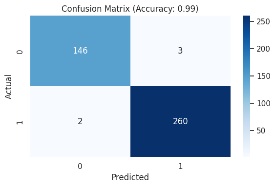

# RNN Law Based Model

## 📌 Team Contribution Table

| Team Member | Contribution |
|-------------|-------------|
| Mostakim Hossain    | Data Preprocessing |
| Tasnim Fardaus    | Augmentation, Model Development & Training |
| Anindita Das Mishi   | Evaluation and Network Image |

---

## 📝 Data Augmentation Methods
For improving the dataset, the following augmentation techniques were applied:
- **Synonym Replacement**: Replacing words with their synonyms.
- **Back Translation**: Translating text to another language and back.
- **Random Insertion & Deletion**: Inserting and deleting random words.
- **Text Paraphrasing**: Using NLP models to rephrase claims.

The augmented dataset is stored inside the `Augmented Data` folder, along with labels.

---

## 📊 RNN Results (5-Fold Cross-Validation)

| Fold | Accuracy | Precision | Recall | F1 Score |
|------|----------|------------|--------|----------|
| 1    | 0.8280   | 0.8267     | 0.8280 | 0.8259   |
| 2    | 0.9345   | 0.9382     | 0.9345 | 0.9332   |
| 3    | 0.9232   | 0.9269     | 0.9232 | 0.9239   |
| 4    | 0.8390   | 0.8455     | 0.8390 | 0.8408   |
| 5    | 0.9569   | 0.9574     | 0.9569 | 0.9567   |
| **Average** | **0.8963** | **0.8989** | **0.8963** | **0.8961** |


## 📊 Confusion Matrix


3️⃣ **Modify `test_script.py` to input new text samples.**

---

## 🤖 BERT Model Evaluation

As an extension of our work, we experimented with a fine-tuned **BERT-based model**, which achieved an impressive accuracy of **99%** on the same legal claim classification task.

📌 **How to Test the BERT Model:**
1. Install the required Python libraries manually:
   ```
      !pip install transformers
      !pip install tensorflow
   ```
      
3. Navigate to: ```Phase 2/Testing Bert Model/```
4. Run the script: ```python testing_Bert.py```
5. Sample data can be found at ```Phase 2/Sample Data/```


📈 **BERT Model Results**:
- Accuracy: **99%**
- Confusion Matrix:

  

- Network Diagram:


## 📊 BERT Results

| Accuracy | Precision | Recall | F1 Score |
|----------|------------|--------|----------|
| 0.99   | 0.99    | 0.98 | 0.98   |


This demonstrates that transformer-based models like BERT are highly effective for this domain.

---


### 🎯 Conclusion
The RNN model achieved an **average accuracy of 90.64%** using 5-fold cross-validation, demonstrating strong performance in text classification.
However, our BERT Model acheived **average accuracy of 99%**.

