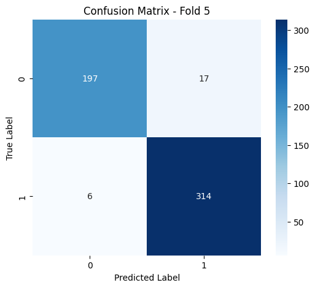
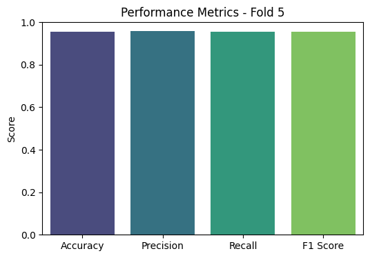

# RNN Law Based Model

## 📌 Team Contribution Table

| Team Member | Contribution |
|-------------|-------------|
| Mostakim Hossain    | Data Preprocessing |
| Tasnim Fardaus    | Augmentation, Model Development & Training |
| Anindita Das Mishi   | Evaluation |

---

## 📝 Data Augmentation Methods
For improving the dataset, the following augmentation techniques were applied:
- **Synonym Replacement**: Replacing words with their synonyms.
- **Back Translation**: Translating text to another language and back.
- **Random Insertion & Deletion**: Inserting and deleting random words.
- **Text Paraphrasing**: Using NLP models to rephrase claims.

The augmented dataset is stored inside the `Augmented Data` folder, along with labels.

---

## 📊 Final Results (5-Fold Cross-Validation)

| Fold | Accuracy | Precision | Recall | F1 Score |
|------|----------|------------|--------|----------|
| 1    | 0.8280   | 0.8267     | 0.8280 | 0.8259   |
| 2    | 0.9345   | 0.9382     | 0.9345 | 0.9332   |
| 3    | 0.9232   | 0.9269     | 0.9232 | 0.9239   |
| 4    | 0.8390   | 0.8455     | 0.8390 | 0.8408   |
| 5    | 0.9569   | 0.9574     | 0.9569 | 0.9567   |
| **Average** | **0.8963** | **0.8989** | **0.8963** | **0.8961** |

## 📊 Confusion Matrix

3️⃣ **Modify `test_script.py` to input new text samples.**

---

### 🎯 Conclusion
The RNN model achieved an **average accuracy of 90.64%** using 5-fold cross-validation, demonstrating strong performance in text classification.

